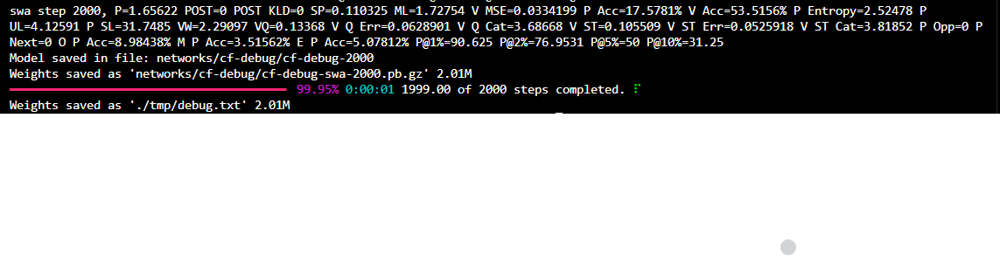

# Introduction

This repository is a fork of https://github.com/daniel-monroe/lczero-training. Its primary goal is to reproduce and study the results presented in the paper *“Mastering Chess with a Transformer Model”* (https://arxiv.org/abs/2409.12272).

The project adapts the original Leela Chess Zero training pipeline to support transformer-based architectures. It is intended as a research-oriented codebase for exploring training dynamics, architectural choices, and reproducibility rather than as a polished end-user application.


# Setup


## Prerequisites
- This repository is designed to run on **Linux**.
- If you are working on **Windows**, you must have **Windows Subsystem for Linux (WSL)** installed and configured.
- A working **conda** or **mamba** installation (e.g. Miniconda or Mambaforge).
- **For training with GPU:** An NVIDIA GPU with a compatible NVIDIA driver installed.
  - Must support **CUDA ≥ 12.2**
- All scripts/commands assume your terminal is opened at the **root directory of this repository**
- [Recommended] The Protocol Buffers compiler (`protoc`) is installed:
  ```bash
  sudo apt update
  sudo apt install -y protobuf-compiler

### Why Protocol Buffers Compilation Is Required

The `.proto` files located in `libs/lczero-common/proto/` (`chunk.proto` and `net.proto`) define message schemas-structured templates that specify how data is organized and serialized for communication (see the [Protocol Buffers documentation](https://protobuf.dev/overview/))

These schemas are not directly usable by Python. They must first be compiled into Python modules using `protoc`. The generated Python files provide:

- **Typed message classes**
- **Efficient binary serialization and deserialization**
- **A single, well-defined structure for exchanging data between components**

Without compiling these `.proto` files, the corresponding Python imports will fail and any code relying on these message definitions will not run.

**Note:**
The repository **already** includes pre-compiled Python files in `tf/proto/`. If you modify any `.proto` files, you must run `init.sh` to regenerate the corresponding Python files in `tf/proto/` so that the changes are reflected in the Python code. **As provided, the repository is fully self-contained and can be used without running any compilation steps.**


## Setup of Conda Environment and Repository

Create a new conda environment with the required Python version:

```bash
conda create --name <ENV_NAME> python=3.10
conda activate <ENV_NAME>
```

Once the environment is activated, clone the repository and navigate into its root directory:
```bash
git clone https://github.com/dcnhn/lczero-training.git
cd lczero-training
```

After cloning, install the Python dependencies.
For a system with **NVIDIA GPU**:
```bash
pip install -r ./tf/requirements.txt
```
Otherwise:
```bash
pip install -r ./tf/requirements_cpu.txt
```

## Verify Environment Setup
Run the following script to verify that the environment is correctly configured:
```bash
# For GPU
python tf/train.py --cfg tf/configs/debug.yaml  --output ./tmp/debug.txt

# For CPU
python tf/train.py --cfg tf/configs/debug_cpu.yaml  --output ./tmp/debug.txt
```
This command runs a small-scale debug training to validate that all dependencies, configurations, and runtime components are working correctly.

A successful run should complete without errors and produce output similar to the following:


# Training

## Data preparation
In order to start a training session you first need to download training data from https://storage.lczero.org/files/training_data/.
The **LCZero database** contains multiple versions of the training data format, reflecting changes and improvements over time.<br>
⚠️ **Recommendation (as of 2026-02-17):** use training data generated in **2024 or later**, as older datasets may rely on deprecated formats or lack newer features expected by the current training pipeline.

### [OPTIONAL] Automated Data Fetching and Download

For convenience, a script is provided that can fetch training data from:

- `https://storage.lczero.org/files/training_data/`
- or `https://storage.lczero.org/files/training_data/<SUB_DIR>/`

The script performs the following tasks:

- Filters out all data generated **before 2024**
- Generates a **csv-file** containing metadata
- Generates a **txt-file** (default name: *lczero_largest_10_tars.txt*) containing only URLs, suitable for use with `wget`

For example:
```bash
python lc0_data_scraper.py 
  --lczero-url https://storage.lczero.org/files/training_data/test91/
```

<!-- #### `--lczero-url`

Base URL to scrape for LCZero training data.
Default: https://storage.lczero.org/files/training_data/

#### `--save-top`

Number of the largest .tar files (by size) to save to the output list.
Type: integer
Default: 10 -->

| Option         | Description                                           | Type    | Default                                                   |
|----------------|-------------------------------------------------------|---------|-----------------------------------------------------------|
| `--lczero-url` | Base URL to scrape for LCZero training data            | string  | `https://storage.lczero.org/files/training_data/`         |
| `--save-top`   | Number of the largest `.tar` files (by size) to save   | integer | `10`                                                      |


To download the data, you can execute the following command (assuming the default file name):
```bash
wget -i lczero_largest_10_tars.txt -c
```
File free to modify the text file before starting the download process.


# Quickstart

## Installation

This repo has been tested with tensorflow versions 2.9-2.15. If you want to use the newest tensorflow version (which handles all the cuda stuff for you), run `pip install -r requirements.txt`. Otherwise, you'll need to install tensorflow-addons, which requires tensorflow<=2.12. To use an older version, run `pip install -r trequirements_tf_2_9.txt` Note that only tensorflow versions <2.11 support Windows natively. Run ./init.sh to compile the protobuf files.

## Data preparation

In order to start a training session you first need to download training data from https://storage.lczero.org/files/training_data/. Several chunks/games are packed into a tar file, and each tar file contains an hour worth of chunks. Preparing data requires the following steps:

```
wget https://storage.lczero.org/files/training_data/training-run1--20200711-2017.tar
tar -xzf training-run1--20200711-2017.tar
```

## Training pipeline

Now that the data is in the right format one can configure a training pipeline. This configuration is achieved through a yaml file, see `training/tf/configs/example.yaml`:

The configuration is pretty self explanatory, if you're new to training I suggest looking at the [machine learning glossary](https://developers.google.com/machine-learning/glossary/) by google. Now you can invoke training with the following command:

```bash
./train.py --cfg configs/example.yaml --output /tmp/mymodel.txt
```

This will initialize the pipeline and start training a new neural network. You can view progress by invoking tensorboard:

```bash
tensorboard --logdir leelalogs
```

If you now point your browser at localhost:6006 you'll see the trainingprogress as the trainingsteps pass by. Have fun!

## Restoring models

The training pipeline will automatically restore from a previous model if it exists in your `training:path` as configured by your yaml config. For initializing from a raw `weights.txt` file you can use `training/tf/net_to_model.py`, this will create a checkpoint for you.

## Supervised training

Generating trainingdata from pgn files is currently broken and has low priority, feel free to create a PR.


# What's new here?

I've added a few features and modules to the training pipeline. Please direct any questions to the Leela Discord server.


## Architectural improvements
Replacing the smolgen layer used by the second, third, and fourth models in the BT series, we're now using learned relative position encodings.

## Quality of life
There are three quality of life improvements: a progress bar, new metrics, and pure attention code

Progress bar: A simple progress bar implemented in the Python `rich` module displays the current steps (including part-steps if the batches are split) and the expected time to completion.

Pure attention: The pipeline no longer contains any code from the original ResNet architecture. This makes for clearer yamls and code. The protobuf has been updated to support smolgen, input gating, and the square relu activation function.

## More metrics

I've added train value accuracy and train policy accuracy for the sake of completeness and to help detect overfitting. The speed difference is negligible. There are also three new losses metrics to evaluate policy. The cross entropy we are currently using is probably still the best for training, though we could try instead to turn the task into a classification problem, effectively using one-hot vectors at the targets' best moves, though this would run the risk of overfitting.

Thresholded policy accuracies: the thresholded policy accuracy @x% is the percent of moves for which the net has policy at least x% at the move the target thinks is best.

Reducible policy loss is the amount of policy loss we can reduce, i.e., the policy loss minus the entropy of the policy target.

The search policy loss is designed to loosely describe how long it would take to find the best move in the average position. It is implemented as the average of the multiplicative inverses of the network's policies at the targets' top moves, or one over the harmonic mean of those values. This is not too accurate since the search algorithm will often give up on moves the network does not like unless they provide returns that the network can immediately recognize.


